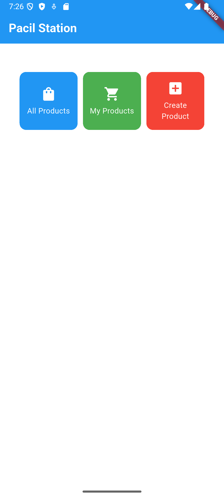

# Tugas 7: Elemen Dasar Flutter

**Nama:** Heraldo Arman  
**NPM:** 2406420702  
**Kelas:** PBP - E  
**Link Penugasan:** [Tugas 7](https://pbp-fasilkom-ui.github.io/ganjil-2026/assignments/individual/assignment-7)

---

## 1. Apa itu _widget tree_ pada Flutter dan bagaimana hubungan _parent–child_ (induk–anak) bekerja antar widget?


Sumber: [medium](https://medium.com/@mca.saboor/flutter-widget-and-widget-tree-3585a9f94d7a)

_Widget tree_ adalah susunan atau struktur dari semua widget yang ada di dalam aplikasi flutter. Bisa dibilang ini semacam pohon yang menunjukkan siapa yang ada di dalam siapa.
Di flutter, hampir semua hal adalah widget seperti teks, tombol, ikon, layout, dan yang lainnya. Widget widget ini saling berhubungan tersusun dari atas ke bawah. Widget yang di atas disebut parent dan di dalamnya disebut child. Hubungan ini menentukan bagaimana tampilan dan perilaku elemen-elemen di layar dibentuk.

---

## 2. Sebutkan semua widget yang kamu gunakan dalam proyek ini dan jelaskan fungsinya.

1. **`MaterialApp`**
   Menjadi dasar dari aplikasi Flutter yang memakai gaya dan aturan desain _Material Design_.
   Menyediakan tema, warna, dan mengatur halaman awal aplikasi.

2. **`Scaffold`**
   Menyediakan struktur dasar untuk setiap halaman, seperti tempat untuk `AppBar`, `Body`, dan lainnya .
   Bisa dibilang ini adalah kerangka utama tampilan aplikasi.

3. **`AppBar`**
   Bagian atas halaman yang menampilkan judul aplikasi (dalam kasus ini adalah “Pacil Station”).
   Biasanya berisi nama halaman, ikon, atau tombol menu.

4. **`Padding`**
   Memberi jarak di sekitar konten agar tampilan tidak terlalu menempel di tepi layar.

5. **`Column`**
   Menyusun widget secara vertikal (dari atas ke bawah).
   Dalam proyek ini digunakan untuk menata bagian-bagian tampilan agar rapi.

6. **`Center`**
   Meletakkan widget di tengah layar.

7. **`GridView.count`**
   Menampilkan beberapa elemen dalam bentuk grid (seperti kotak-kotak).
   Digunakan untuk menampilkan tiga tombol: _All Products_, _My Products_, dan _Create Product_.

8. **`Material`**
   Memberikan efek _Material Design_ seperti bayangan dan warna latar pada tombol (card).

9. **`InkWell`**
   Membuat area yang bisa ditekan (klik).
   Digunakan agar tombol menampilkan _SnackBar_ ketika ditekan.

10. **`SnackBar`**
    Pesan kecil yang muncul di bagian bawah layar ketika tombol ditekan.
    Misalnya, menampilkan teks seperti “Kamu telah menekan tombol All Products!”.

11. **`Icon`**
    Menampilkan ikon pada setiap tombol.

12. **`Text`**
    Menampilkan tulisan seperti nama tombol dan judul aplikasi.

13. **`SizedBox`**
    Memberi jarak atau ruang kosong antar elemen agar tata letak lebih rapi.

14. **`Card`**
    Memberikan tampilan seperti kartu dengan bayangan dan tepi melengkung.

---

## 3. Apa fungsi dari widget `MaterialApp`? Jelaskan mengapa widget ini sering digunakan sebagai _root widget_.

`MaterialApp` adalah widget utama yang digunakan untuk memulai aplikasi flutter dengan gaya **Material Design** dari Google.
Widget ini biasanya menjadi **root widget** (widget paling atas) dari aplikasi karena dia mengatur banyak hal penting yang dibutuhkan oleh aplikasi.

Beberapa fungsi penting `MaterialApp`:

1. **Menentukan halaman utama aplikasi** dengan properti `home`. Misalnya, `home: MyHomePage()` akan menampilkan halaman tersebut pertama kali.
2. **Mengatur tema dan warna aplikasi** seperti warna utama (primary color), font, atau gaya tombol.
3. **Menentukan judul aplikasi** melalui properti `title`.
4. **Mengaktifkan fitur Material Design**, seperti _AppBar_, _SnackBar_, _Drawer_, dan _FloatingActionButton_ agar tampil dengan gaya khas Android.

Karena `MaterialApp` menyediakan semua pengaturan dasar ini, maka widget ini hampir selalu ditempatkan di bagian paling luar dari aplikasi Flutter sebelum semua widget lainnya.
Tanpa `MaterialApp`, beberapa widget khas Material seperti `Scaffold` atau `SnackBar` tidak bisa berfungsi dengan baik.

---

## 4. Jelaskan perbedaan antara `StatelessWidget` dan `StatefulWidget`. Kapan kamu memilih salah satunya?

di flutter, semua tampilan dibuat dari widget. Ada dua jenis utama widget berdasarkan apakah tampilannya bisa berubah atau tidak, yaitu `StatelessWidget` dan `StatefulWidget`.

### `StatelessWidget`

`StatelessWidget` adalah widget yang **tidak memiliki perubahan tampilan** setelah dibuat.
Artinya, semua data dan tampilan di dalamnya **tetap sama** atau **statis** selama aplikasi berjalan.

Contohnya:

- Teks statis
- Tombol dengan aksi sederhana
- Ikon atau gambar yang tidak berubah

### `StatefulWidget`

`StatefulWidget` adalah widget yang **bisa berubah tampilannya** saat aplikasi berjalan.
Widget ini memiliki _state_ (keadaan) yang bisa diubah dengan memanggil `setState()`.

Contohnya:

- Tombol yang warnanya berubah saat ditekan
- Counter yang bertambah saat diklik
- Form input yang menampilkan teks yang diketik pengguna

### Kapan digunakan?

- Gunakan **`StatelessWidget`** jika tampilan kamu tidak perlu berubah (sederhana dan statis).
- Gunakan **`StatefulWidget`** jika kamu butuh interaksi atau perubahan data yang akan mengubah tampilan di layar.

---

## 5. Apa itu `BuildContext` dan mengapa penting di Flutter? Bagaimana penggunaannya di metode `build()`?

`BuildContext` adalah objek yang menyimpan informasi tentang posisi sebuah widget di dalam _widget tree_.
Dengan kata lain, `BuildContext` membantu Flutter mengetahui di mana letak suatu widget berada dan apa saja yang bisa diakses oleh widget itu. misalnya tema, warna, atau _parent widget_-nya.

Setiap kali Flutter memanggil metode `build()`, ia akan memberikan `BuildContext` agar widget bisa tahu konteks tempatnya berada di dalam aplikasi.

`BuildContext` sangat penting karena:

1. Digunakan untuk mengakses tema dan warna aplikasi dengan `Theme.of(context)`.
   Contohnya di kode yang sudah dibuat sebelumnya:
   ```dart
   backgroundColor: Theme.of(context).colorScheme.primary,
   ```
   Di sini, `context` membantu mengambil warna utama dari tema aplikasi.
2. Dipakai untuk menampilkan widget lain seperti `SnackBar` atau dialog.
   ```dart
   ScaffoldMessenger.of(context).showSnackBar(
     SnackBar(content: Text("Kamu telah menekan tombol All Products!")),
   );
   ```
   Tanpa `context`, Flutter tidak tahu di mana harus menampilkan `SnackBar` tersebut. Dalam kasus ini Snackbar ditampilkan di dalam scaffold
3. Membantu **navigasi antar halaman** dengan `Navigator.of(context)`.

---

## 6. Jelaskan konsep _hot reload_ di Flutter dan bagaimana bedanya dengan _hot restart_.

**_Hot reload_** adalah fitur di Flutter yang memungkinkan kita melihat hasil perubahan kode secara langsung tanpa perlu menghentikan aplikasi.
Saat kita menekan _hot reload_, Flutter akan:

- Menyimpan dan memperbarui kode yang diubah,
- Menjalankan ulang fungsi `build()` pada widget yang terpengaruh,
- Tidak menghapus data atau state yang sedang berjalan.

**_Hot Restart_** adalah dimana kita memulai ulang seluruh aplikasi
Flutter akan membangun ulang semua widget dari nol dan menghapus semua state atau data yang sebelumnya disimpan.

| Fitur           | Apa yang dilakukan             | State aplikasi  | Kapan digunakan                                |
| --------------- | ------------------------------ | --------------- | ---------------------------------------------- |
| **Hot Reload**  | Memperbarui kode yang berubah  | Tetap tersimpan | Saat mengubah tampilan/UI                      |
| **Hot Restart** | Memulai ulang seluruh aplikasi | Hilang/reset    | Saat mengubah struktur atau data awal aplikasi |

---

## Lampiran Screenshot Project



# Tugas 8:

**Nama:** Heraldo Arman  
**NPM:** 2406420702  
**Kelas:** PBP - E  
**Link Penugasan:** [Tugas 8](https://pbp-fasilkom-ui.github.io/ganjil-2026/assignments/individual/assignment-8)

---

## 1. Jelaskan perbedaan antara `Navigator.push()` dan `Navigator.pushReplacement()` pada Flutter. Dalam kasus apa sebaiknya masing-masing digunakan pada aplikasi Football Shop kamu?

### Navigator.push()

- **Fungsi**: Menambahkan halaman baru di atas stack navigasi tanpa menghapus halaman sebelumnya
- **Behavior**: Halaman sebelumnya tetap ada di memori dan dapat diakses dengan tombol back
- **Stack**: Current Page → New Page (ditumpuk)

```dart
Navigator.push(
  context,
  MaterialPageRoute(builder: (context) => NewPage()),
);
```

### Navigator.pushReplacement()

- **Fungsi**: Mengganti halaman saat ini dengan halaman baru
- **Behavior**: Halaman sebelumnya dihapus dari stack, tidak bisa kembali dengan tombol back
- **Stack**: Current Page → New Page (diganti)

```dart
Navigator.pushReplacement(
  context,
  MaterialPageRoute(builder: (context) => NewPage()),
);
```

### Penggunaan Navigator.push() dalam Aplikasi Pacil Station:

```dart
onTap: () {
  Navigator.push(
    context,
    MaterialPageRoute(
      builder: (context) =>
          MyHomePage(colorScheme: Theme.of(context).colorScheme),
    ),
  );
},
```

### Penggunaan Navigator.push() dalam Aplikasi Pacil Station:

ga ada 😅

## Key Differences

| Aspek          | Navigator.push()  | Navigator.pushReplacement() |
| -------------- | ----------------- | --------------------------- |
| Stack Behavior | Menambah ke stack | Mengganti di stack          |
| Tombol Back    | Bisa kembali      | Tidak bisa kembali          |

---

## 2. Bagaimana kamu memanfaatkan _hierarchy widget_ seperti `Scaffold`, `AppBar`, dan `Drawer` untuk membangun struktur halaman yang konsisten di seluruh aplikasi?

di `main.dart` saya mengimplementasikan MaterialApp untuk membuat tema dasar

```dart
    return MaterialApp(
      title: 'Pacil Station',
      theme: ThemeData(
        colorScheme: ColorScheme.fromSwatch(
          primarySwatch: Colors.blue,
        ).copyWith(secondary: Colors.blueAccent[400]),
      ),
      home: MyHomePage(
        colorScheme: Theme.of(context).colorScheme,
      ),
    );
```

lalu di `menu.dart` saya mengimplementasikan scaffold sebagai struktur dasar halaman.
Setiap halaman utama seperti MyHomePage dan ProductFormPage menggunakan Scaffold sebagai widget paling luar.

```dart
   return Scaffold(
     appBar: AppBar(...),
     drawer: LeftDrawer(),
     body: ...,
   );

```

lalu di `left_drawer.dart` saya mengimplementasikan Drawer sebagai navigasi global antar halaman.
Komponen Drawer diwakili oleh widget LeftDrawer, yang didefinisikan secara terpisah agar bisa digunakan ulang di setiap halaman.

```dart
drawer: LeftDrawer(),
```

---

## 3. Dalam konteks desain antarmuka, apa kelebihan menggunakan _layout widget_ seperti `Padding`, `SingleChildScrollView`, dan `ListView` saat menampilkan elemen-elemen form? Berikan contoh penggunaannya dari aplikasi kamu.

1. **`Padding` – menjaga jarak dan keterbacaan elemen**
   `Padding` digunakan untuk memberi jarak antara batas layar dengan elemen-elemen form agar tampilan tidak terasa sempit dan tetap mudah dibaca.
   Dengan `Padding`, antarmuka terlihat lebih bersih dan profesional.

   **Contoh:**

   ```dart
   Padding(
     padding: const EdgeInsets.all(16.0),
     child: TextFormField(
       decoration: InputDecoration(
         labelText: "Nama Produk",
         border: OutlineInputBorder(),
       ),
     ),
   )
   ```

2. **`SingleChildScrollView` – memungkinkan form di-_scroll_**
   Saat jumlah elemen form cukup banyak, tampilan bisa melampaui tinggi layar.
   Dengan `SingleChildScrollView`, seluruh isi form bisa digulir ke bawah, mencegah elemen terpotong dan menjaga aksesibilitas di berbagai ukuran layar.

   **Contoh:**

   ```dart
   body: SingleChildScrollView(
     child: Padding(
       padding: const EdgeInsets.all(16.0),
       child: Form(...),
     ),
   ),
   ```

3. **`ListView` – menampilkan banyak elemen dengan efisiensi tinggi**
   `ListView` digunakan untuk menampilkan daftar elemen secara vertikal dengan kemampuan _scrolling_ bawaan.
   Berbeda dengan `Column`, `ListView` otomatis mengatur _scrollable layout_ dan cocok ketika jumlah item tidak tetap atau dapat bertambah secara dinamis.
   **Contoh:**
   ```dart
   body: ListView.builder(
     itemCount: items.length,
     itemBuilder: (context, index) {
       return ProductCard(item: items[index]);
     },
   ),
   ```

---

## 4. Bagaimana kamu menyesuaikan *warna tema* agar aplikasi Football Shop memiliki identitas visual yang konsisten dengan brand toko?

penyesuaian warna tema dilakukan melalui konfigurasi ThemeData
```dart
class MyApp extends StatelessWidget {
  const MyApp({super.key});
  @override
  Widget build(BuildContext context) {
    return MaterialApp(
      title: 'Pacil Station',
      theme: ThemeData(
        colorScheme: ColorScheme.fromSwatch(
          primarySwatch: Colors.blue,
        ).copyWith(secondary: Colors.blueAccent[400]),
      ),
      home: MyHomePage(
        colorScheme: Theme.of(context).colorScheme,
      ),

    );
  }
}
```
lalu agar menyesuaikan di komponen lainnya, saya menggunakan context color scheme agar bisa menyesuaikan dengan tema yang sudah dibuat

```dart
  @override
  Widget build(BuildContext context) {
    return Scaffold(
      appBar: AppBar(
        title: const Center(child: Text('Form Tambah Produk')),
        backgroundColor: Theme.of(context).colorScheme.primary,
        foregroundColor: Theme.of(context).colorScheme.onPrimary,
      ),

```

---


# Tugas 9:

**Nama:** Heraldo Arman  
**NPM:** 2406420702  
**Kelas:** PBP - E  
**Link Penugasan:** [Tugas 9](https://pbp-fasilkom-ui.github.io/ganjil-2026/assignments/individual/assignment-9)

---

## 1. Jelaskan mengapa kita perlu membuat model Dart saat mengambil/mengirim data JSON? Apa konsekuensinya jika langsung memetakan `Map<String, dynamic>` tanpa model (terkait validasi tipe, null-safety, maintainability)?
- *Type Safety*: Model memberikan validasi tipe yang kuat, mencegah runtime errors
- *Null Safety*: Dart null safety memastikan field yang required tidak null
- *IntelliSense*: IDE dapat memberikan autocomplete dan error detection
- *Maintainability*: Code lebih terstruktur dan mudah di-maintain
- *Validation*: Dapat menambahkan custom validation di constructor

```dart
// Tanpa model - rawan error
Map<String, dynamic> product = response;
String name = product['name']; // Bisa null/wrong type
int price = product['price']; // Runtime error jika string

// Dengan model - type safe
Product product = Product.fromJson(response);
String name = product.fields.name; // Guaranteed string
double price = product.fields.price; // Type validated
```
### Masalah tanpa model:
- Runtime errors saat akses field
- Typo di key name tidak terdeteksi
- Sulit tracking perubahan struktur data
- Debugging lebih sulit
- Tidak ada dokumentasi struktur data


---

## 2. Apa fungsi package _http_ dan _CookieRequest_ dalam tugas ini? Jelaskan perbedaan peran _http_ vs _CookieRequest_.

### Package HTTP:

- Library standar untuk HTTP requests di Flutter
- Fungsi: GET, POST, PUT, DELETE requests
- Tidak handle cookies secara otomatis
- Manual header management

CookieRequest (dari pbp_django_auth):
### Extension dari HTTP client dengan cookie management
- Fungsi: Automatic cookie handling, session management
- Built-in authentication methods (login, logout)
- Django integration features

### Perbedaan peran:
```dart
// HTTP - Manual
import 'package:http/http.dart' as http;
var response = await http.post(
  Uri.parse('url'),
  headers: {'Content-Type': 'application/json'},
  body: json.encode(data)
);

// CookieRequest - Automatic
final request = context.read<CookieRequest>();
var response = await request.postJson('url', data);

```
### Keunggulan CookieRequest:
- Session persistence
- CSRF token handling
- Authentication state management
- Simplified Django integration


---

## 3. Jelaskan mengapa instance _CookieRequest_ perlu untuk dibagikan ke semua komponen di aplikasi Flutter.

- Session Consistency: Semua komponen menggunakan session yang sama
- Cookie Persistence: Cookies login tersimpan di seluruh aplikasi
- Authentication State: Status login dapat diakses di mana saja
- Performance: Single instance lebih efisien daripada multiple instances
Tanpa sharing, maka setiap komponen punya session terpisah, login di satu tempat tidak berlaku di tempat lain.

Implementasi dengan Provider:
```dart
// main.dart
Provider(
  create: (_) {
    CookieRequest request = CookieRequest();
    return request;
  },
  child: MyApp(),
)

// Di komponen manapun
final request = context.watch<CookieRequest>();
bool isLoggedIn = request.loggedIn;
```

---

## 4. Jelaskan konfigurasi konektivitas yang diperlukan agar Flutter dapat berkomunikasi dengan Django. Mengapa kita perlu menambahkan 10.0.2.2 pada ALLOWED_HOSTS, mengaktifkan CORS dan pengaturan SameSite/cookie, dan menambahkan izin akses internet di Android? Apa yang akan terjadi jika konfigurasi tersebut tidak dilakukan dengan benar?


---

## 5. Jelaskan mekanisme pengiriman data mulai dari input hingga dapat ditampilkan pada Flutter.


---

## 6. Jelaskan mekanisme autentikasi dari login, register, hingga logout. Mulai dari input data akun pada Flutter ke Django hingga selesainya proses autentikasi oleh Django dan tampilnya menu pada Flutter.


---

## 7. Jelaskan bagaimana cara kamu mengimplementasikan checklist di atas secara step-by-step! (bukan hanya sekadar mengikuti tutorial).


---